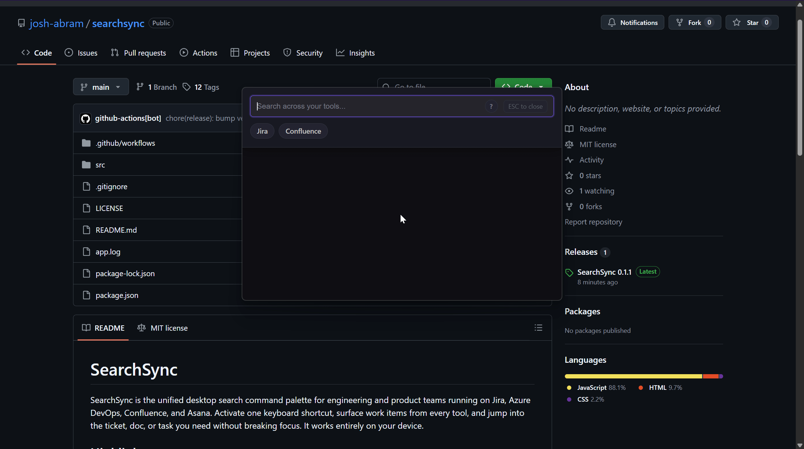

# SearchSync

SearchSync is the unified desktop search command palette for engineering and product teams running on Jira, Azure DevOps, Confluence, and Asana. Activate one keyboard shortcut, surface work items from every tool, and jump into the ticket, doc, or task you need without breaking focus. It works entirely on your device.



## Highlights
- **Unified search** blends Jira issues, Azure DevOps work items, Confluence pages, and Asana tasks into a single result list with intelligent ranking.
- **Global shortcuts** launch the desktop search palette instantly (default `Ctrl+Shift+Space`)
- **Smart relevance** uses BM25 scoring plus behavior signals to improve each query—no cloud training or data sharing required.
- **Real-time performance** fetches results in parallel with local caching so answers appear as you type.
- **Secure & private**: credentials are encrypted via the system keychain and never leave your machine; the app runs 100% locally.
- **Cross-platform** native builds for Windows and Linux today.
## Integrations
Available connectors:
- Jira Software & Service Management (project, issue, and epic search)
- Azure DevOps work items and repos
- Confluence Cloud pages and blog posts
- Asana projects, tasks, and conversations


## Download options
- Windows 10/11 (x64) installer
- Linux AppImage (x86_64)

## Develop locally
```bash
git clone https://github.com/josh-abram/searchsync.git
cd searchsync
npm install

# Run the Electron app
npm run dev        # macOS/Linux
npm run dev-win    # Windows

# Package installers
npm run build      # build for current platform
npm run build:all  # build Windows + Linux installers
```
Generated artifacts land in `dist/`. Use `npm start` to launch the production build experience from source.

## Connect your tools
1. Open **Settings → Integrations** on first launch.
2. Add credentials for each platform:
   - **Jira & Confluence**: cloud base URL, account email, and Atlassian API token.
   - **Azure DevOps**: organization, project, and Personal Access Token with read scope.
   - **Asana**: personal access token with optional workspace or project filters.
3. Run the in-app connection tests to confirm authentication.

SearchSync stores every secret locally, encrypts them with the OS keychain, and scrubs logs automatically.

## Power tips
- Prefix queries (`jsd:`, `ado:`, `con:`, `as:`) to filter by integration instantly.
- Toggle per-source filters to refine results without rewriting your search.
- Enable relevance scores in **Settings** to see how each hit is ranked.
- Open the **Debug** panel for live API traces when troubleshooting.


## License
SearchSync ships under the [MIT License](LICENSE). By contributing, you agree to the same terms.